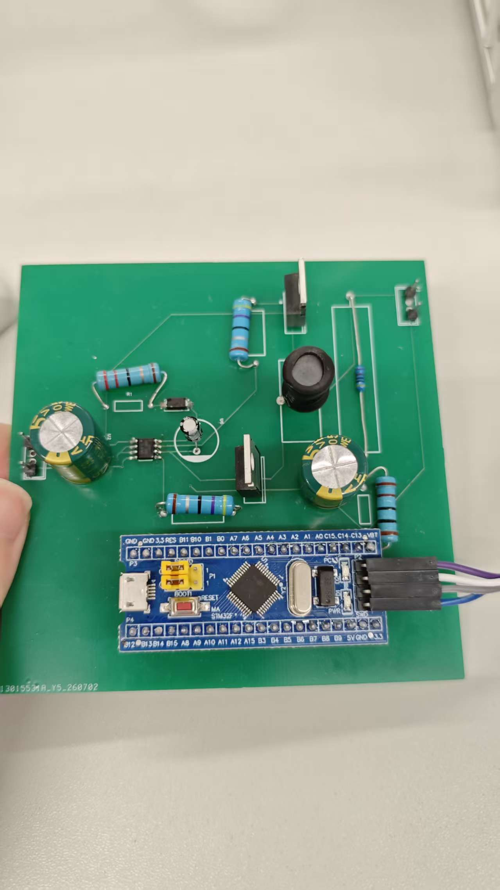
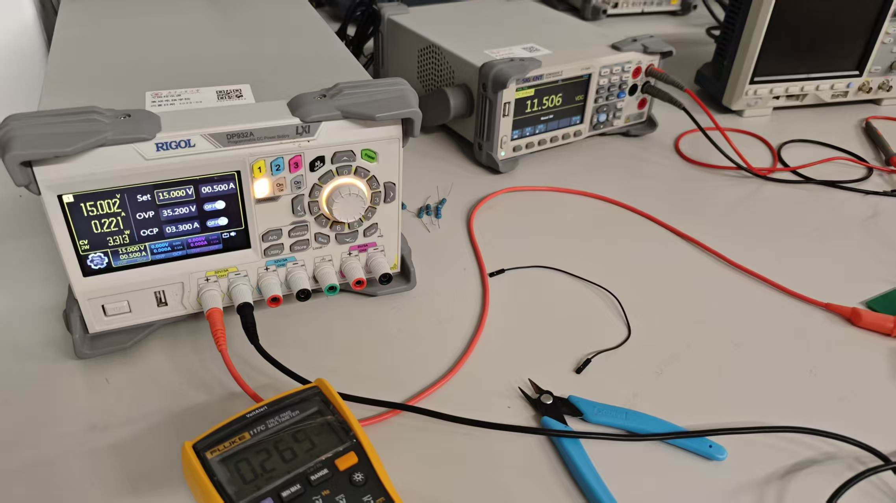

# 基于 STM32 的高效率 Buck 降压电路

## 1. 系统功能总览

本项目设计并实现了一款基于 **STM32F103C8T6** 的数字控制 Buck 降压变换器，具备以下核心功能：

| 功能模块 | 描述 |
|---------|------|
| **降压转换** | 输入 15V 直流，稳定输出 12V 直流 |
| **PWM 驱动** | 100kHz 高频 PWM 信号，驱动 N 沟道 MOSFET |
| **闭环稳压** | 基于数字 PID 算法，实时调节占空比维持输出电压稳定 |
| **电压采样** | 硬件触发 ADC + DMA 传输，实现低延迟电压反馈 |
| **效率优化** | 通过电感选型与 PID 参数整定，满载效率达 92% |
| **PCB 实现** | 完成规范化 PCB 设计，功率地与信号地分离，一次打样成功 |

### PCB打样板如下图：

 
---

## 2. 性能指标

| 参数 | 指标 |
|------|------|
| 输入电压 | 15.0 V DC |
| 输出电压 | 11.5 ~ 12.0 V（稳压精度 ±0.1V） |
| 开关频率 | 100 kHz |
| 输出纹波 | < 30 mV（典型值） |
| 满载效率 | **92.03%**（负载 44Ω） |
| 负载响应时间 | < 1 ms |
| 占空比调节范围 | 10% ~ 90%（软件限幅） |

---

## 3. 测试验证结果
### 满载44R时的测量参数
| 参数 | 数值 |
|------|------|
| 输入电压 | 15.002 V |
| 输入电流 | 0.221 A |
| 输入功率 | 3.313 W |
| 输出电压 | 11.506 V |
| 输出电流 | 0.265 A |
| 输出功率 | 3.049 W |
| **转换效率** | **92.03%** |

---

