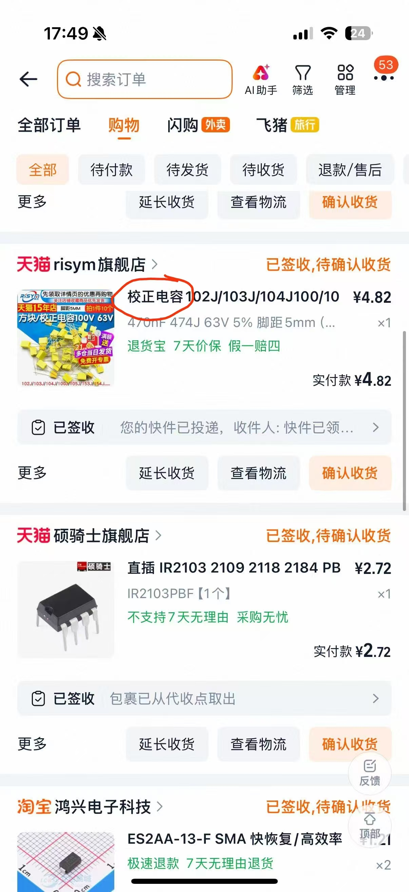
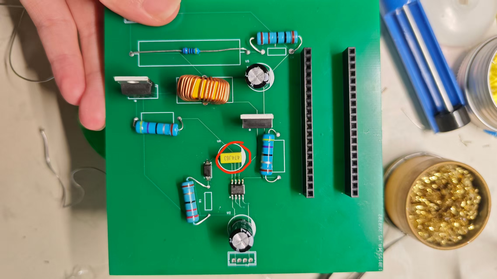
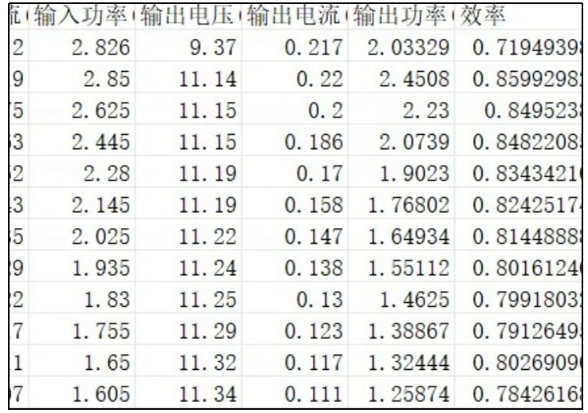

## 撰写者：李可伊
# 一、物料情况

所有物料均全部到齐

# 二、当前完成进度

## 已完成工作
- 软件设计
- PCB设计和焊接

- 洞洞板设计和焊接

## 进行中工作
- 软件调试
- 对两个方案的板子的调试与改进

# 三、硬件调试情况
## 完成功能：上电成功实现15V转12V（空载时）
## 遇到的困难：
- 问题描述：空载时电压正常（12V），但接入电子负载后电流几乎为零，效率约为 0%
- 原因分析：电路中使用的 470nF 电容为校正电容（无极性），ESR 过大，无法在 100kHz 开关频率下有效储能 
- 解决方案：将 470nF 校正电容更换为 470μF 电解电容 
- 结果：带载能力恢复正常，输出电流可达额定值

# 四、软件调试情况
## 完成功能：软件各模块均开发完毕，代码运行无报错，已烧录。
## 遇到的困难：
- 问题描述：带载输出电压正常，但转换效率仅约 85%
- 原因分析：
1. PID 参数（初始 Kp = 1.2）导致占空比调节振荡，增加额外开关损耗
2. ADC 采样与 PID 计算时序未同步，控制滞后影响效率
- 解决方案：
1.重新整定 PID 参数：Kp = 0.8, Ki = 0.05, Kd = 0.02
2.优化软件时序，ADC 采样由 TIM1 触发同步进行
3. 配置 TIM1 死区时间为 1μs

