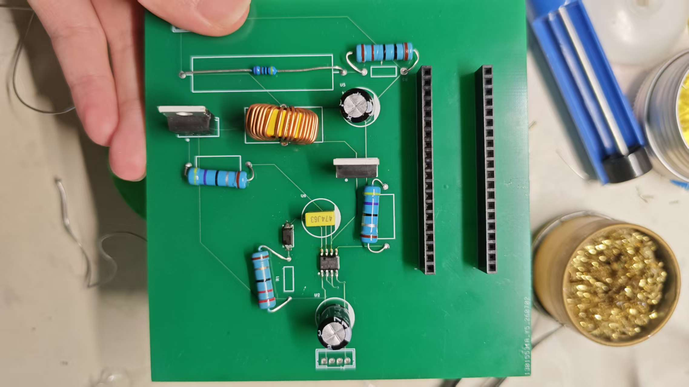
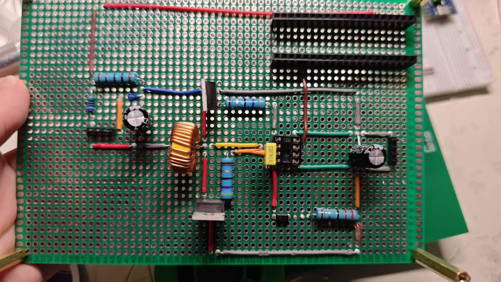

## 撰写者：李可伊
# 一、物料情况

所有物料均全部到齐

# 二、当前完成进度

## 已完成工作
- 软件设计与调试
- PCB设计和焊接

- 洞洞板设计和焊接

## 进行中工作
- 对两个方案的板子的调试与改进

# 三、硬件调试情况
- 完成功能：上电成功实现15V转12V（空载时）
- 难题：接上负载后，电压和电流没有变化，即无论接了几欧的负载，功率都为零。
解决方案：寻找硬件上的问题，发现电容
# 四、软件调试情况
软件各模块均开发完毕，代码运行无报错，已烧录。

