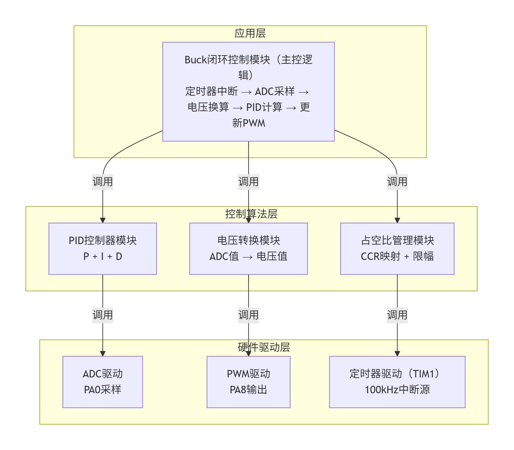
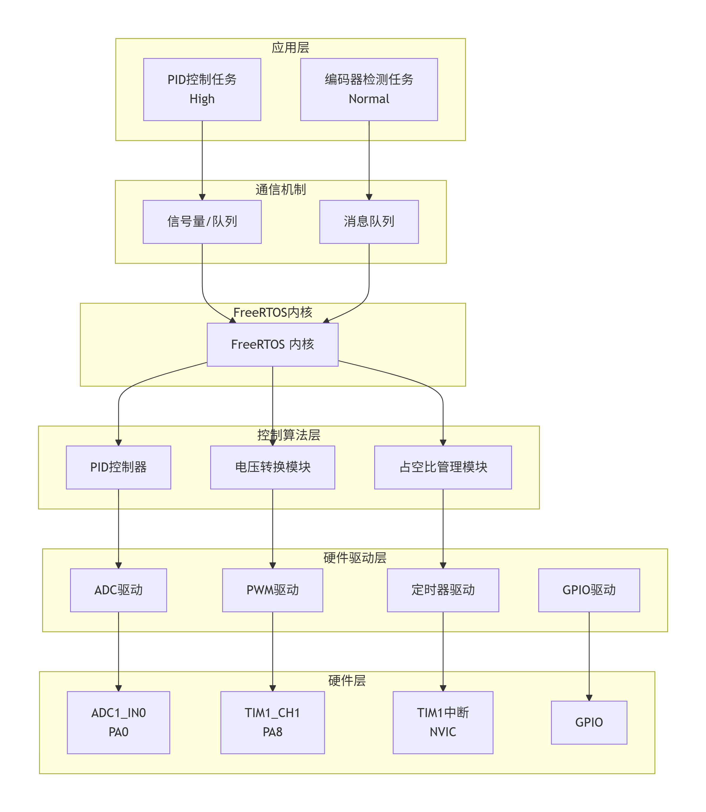
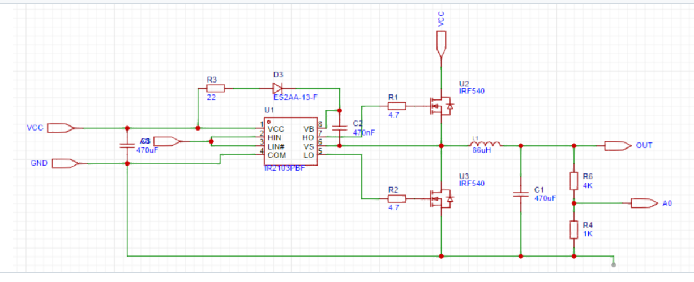
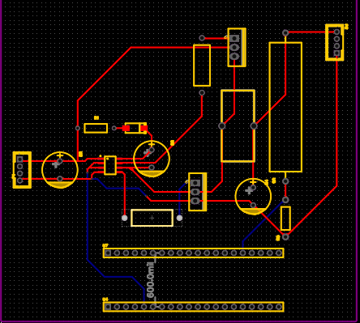
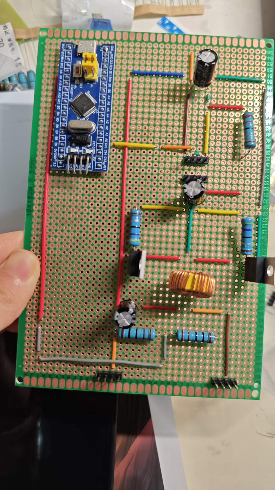

# 物料情况

未到：

- 最小系统板的插座
- IR2103直插式芯片及其插座
- 470nF电容  
  （预计七月二号到）

其余材料均到货。

---

# 软件部分

## 一、模块划分

### 1. 硬件驱动层

| 模块 | ADC驱动模块 | PWM驱动模块 | 定时器驱动模块 | GPIO驱动模块 |
| --- | --- | --- | --- | --- |
| 功能 | 配置ADC1_IN0（PA0）进行输出电压采样，采用定时器触发方式启动转换 | 配置TIM1_CH1（PA8）输出频率100kHz、占空比可调的PWM信号 | 配置TIM1为100kHz中断源，作为PID控制算法的时间基准 | |
| 外设 | ADC1 | TIM1 | TIM1、NVIC | GPIOA, GPIOB |
| 接口 | HAL_ADC_Start(), HAL_ADC_GetValue() | HAL_TIM_PWM_Start(), __HAL_TIM_SET_COMPARE() | HAL_TIM_Base_Start_IT() | HAL_GPIO_Init() |

### 2. 控制算法层

| 模块 | PID控制器模块 | 电压转换模块 | 占空比管理模块 |
| --- | --- | --- | --- |
| 功能 | 实现位置式PID算法，包含比例（P）、积分（I）、微分（D）三项运算 | 将ADC原始数值（0~4095）转换为实际电压值，包含分压网络比例换算 | 实现PWM占空比的CCR值映射及10%到90%的安全限幅保护 |
| 依赖模块 | 无 | ADC驱动模块 | PWM驱动模块 |

### 3. 应用层

| 模块 | Buck闭环控制模块 | 系统初始化模块 |
| --- | --- | --- |
| 功能 | 整合ADC采样、电压换算、PID计算、PWM更新，形成完整的电压闭环控制回路 | 负责系统时钟配置及各外设的初始化 |
| 依赖模块 | 所有下层模块 | HAL库 |

### 4. 模块调用关系图

---
## 二、关键算法描述

### 1. PID控制算法

### （1）算法原理
PID控制器根据目标值与实际值的偏差，经比例、积分、微分运算后生成控制量，动态调整系统输出。

### （2）算法公式
位置式PID离散表达式：

u(k) = Kp · e(k) + Ki · Σe(j) + Kd · [e(k) - e(k-1)]

本设计参数：Kp = 0.8，Ki = 0.05，Kd = 0.02。

### （3）参数整定
试凑法整定步骤：
1. 先调 Kp 至系统微振荡
2. 再增 Ki 消除静差
3. 最后加 Kd 抑制超调

### （4）占空比更新
D(k) = 0.80 + u(k) / 100

限幅至 10% ~ 90% 后，更新 PWM 比较值：
CCR = D × 720
---

### 2. 电压采样与转换算法

输出电压经分压网络衰减后送入ADC：

$$V_{A0} = V_{OUT} \times \frac{4}{5}$$

12位ADC将模拟电压转为数字量 $N_{ADC}$：

$$V_{A0} = \frac{N_{ADC}}{4096} \times 3.3\text{V}$$

### 合并得输出电压

VOUT = (NADC × 4.125) / 4096

---

### 3. PWM占空比控制算法

Buck电路CCM模式下：
VOUT = ∫(VIN) dt，理论占空比 D = 12/15 = 0.80。

定时器 ARR = 719，PWM比较值 CCR = D × 720，初始 CCR = 576。

为防止异常，将占空比限幅在 10% ~ 90%，即 CCR ∈ [72, 648]。

---

## 三、外设配置方案

### 1. 建立新工程

参考第5章5.2节，建立一个新的STM32工程。选择芯片"STM32F103C8T6"，设置工程的名称为"BUCK_CLOSE"，选择SWD调试方式，开启外部高速时钟源并修改主频为72 MHz。

---

### 2. 配置TIM1（PWM输出，A8口）

配置TIM1输出单路PWM，频率为100 kHz，引脚设置为PA8。

配置步骤如下：

① 点击"Pinout & Configuration"标签页；  
② 在左侧导航栏中点击"Timers"；  
③ 双击"TIM1"进行配置；  
④ 选择"Clock Source"为"Internal Clock"；  
⑤ 选择"Channel1"为"PWM Generation CH1"（**注意**：不要选择"PWM Generation CH1 CH1N"）；  
⑥ 在"Pinout view"窗口中确认PA8自动配置为"TIM1_CH1"。

配置TIM1的工作参数如下：

| 参数 | 数值 |
|:---|:---|
| Prescaler（预分频器） | 0 |
| Counter Mode（计数模式） | Up |
| Counter Period（计数周期） | 719 |
| Internal Clock Division（内部时钟分频） | No Division |
| Repetition Counter（重复计数器） | 0 |
| auto-reload preload（自动重装载寄存器） | Enable |

通道1的工作参数配置如下：

| 参数 | 数值 |
|:---|:---|
| Mode（输出模式） | PWM mode 1 |
| Pulse（脉冲值/CCR） | 360（初始值） |
| Output compare preload（输出比较预装载） | Enable |
| Fast Mode（快速模式） | Disable |
| CH Polarity（通道极性） | High |

**频率计算**：

fPWM = 72MHz / [(0+1) × (719+1)] = 100kHz
---

### 3. 配置ADC（A0口采样）

配置ADC1的IN0通道，用于采集输出电压反馈值。

配置步骤如下：

① 进入"Pinout & Connectivity"标签页；  
② 在左侧导航栏"Analog"部分，勾选"ADC1"；  
③ 启用"IN0"通道（对应A0引脚）。

ADC1的工作参数设置如下：

| 参数 | 数值 |
|:---|:---|
| Scan Conversion Mode | Disabled |
| Continuous Conversion Mode | Disabled |
| External Trigger Conversion Source | Timer 1 Capture Compare 1 event |
| Data Alignment | Right alignment |
| Rank | 1 |
| Channel | Channel 0 |
| Sampling Time | 1.5 Cycles |

**ADC时钟配置**：在时钟树中，ADC预分频器设为6，ADC时钟 = 72MHz / 6 = 12MHz（不超过14MHz最大值）。

---

### 4. 配置TIM1中断（PID计算触发源）

配置步骤如下：

① 进入"Pinout & Configuration"标签页；  
② 在左侧导航栏中点击"Timers"；  
③ 双击"TIM1"进入配置；  
④ 切换到"NVIC Settings"标签页；  
⑤ 勾选"TIM1 update interrupt"的"Enabled"选项，开启TIM1更新中断。

---

### 5. 配置RCC时钟树

时钟树配置如下：

| 参数 | 数值 |
|:---|:---|
| HSE | 8MHz（外部晶振） |
| PLL Source | HSE |
| PLL MUL | x9 |
| SYSCLK | 72MHz |
| AHB Prescaler | /1（72MHz） |
| APB1 Prescaler | /2（36MHz） |
| APB2 Prescaler | /1（72MHz） |
| ADC Prescaler | /6（12MHz） |

---

### 6. 引脚分配汇总

| 引脚 | 功能 | 配置模式 |
|:---|:---|:---|
| PA8 | TIM1_CH1（PWM输出） | AF推挽输出 |
| PA0 | ADC1_IN0（电压采样） | 模拟输入 |
| PA13 | SWDIO | 调试接口 |
| PA14 | SWCLK | 调试接口 |

---

## 四、任务调度设计（FreeRTOS方案）

### 1. 任务划分

| 任务名称 | PID控制任务 | 编码器检测任务 | 空闲任务 |
| --- | --- | --- | --- |
| 优先级 | osPriorityHigh | osPriorityNormal | osPriorityIdle |
| 堆栈大小 | 256 words | 128 words | 系统分配 |
| 功能描述 | 执行ADC采样、电压换算、PID计算、PWM更新 | 检测旋转编码器状态，调节目标电压 | 系统空闲时执行 |
| 触发方式/周期 | 由TIM1中断通过信号量唤醒，频率100kHz | 50ms周期轮询 | 由系统调度 |

### 2. FreeRTOS配置参数

| 参数 | 推荐值 | 说明 |
|:---|:---|:---|
| `TOTAL_HEAP_SIZE` | 4096 bytes | 系统堆空间 |
| `configMAX_PRIORITIES` | 7 | 最大优先级数 |
| `configUSE_PREEMPTION` | Enabled | 启用抢占式调度 |
| `configUSE_TIME_SLICING` | Enabled | 启用时间片轮转 |
| `configTICK_RATE_HZ` | 1000 | 系统时钟节拍1ms |
| `configMINIMAL_STACK_SIZE` | 128 words | 空闲任务堆栈大小 |

### 3. 在 MX_FREERTOS_Init() 中创建任务：

```c
osThreadDef(PID_Task, StartPID_Task, osPriorityHigh, 0, 256);
PID_TaskHandle = osThreadCreate(osThread(PID_Task), NULL);

osThreadDef(Encoder_Task, StartEncoder_Task, osPriorityNormal, 0, 128);
Encoder_TaskHandle = osThreadCreate(osThread(Encoder_Task), NULL);
```
# 五、系统软件架构总图


## 硬件部分
- 电路原理图

- 方案一 PCB 布局规划： 

- 方案二 洞洞板（备用）：等材料到齐开始焊接

